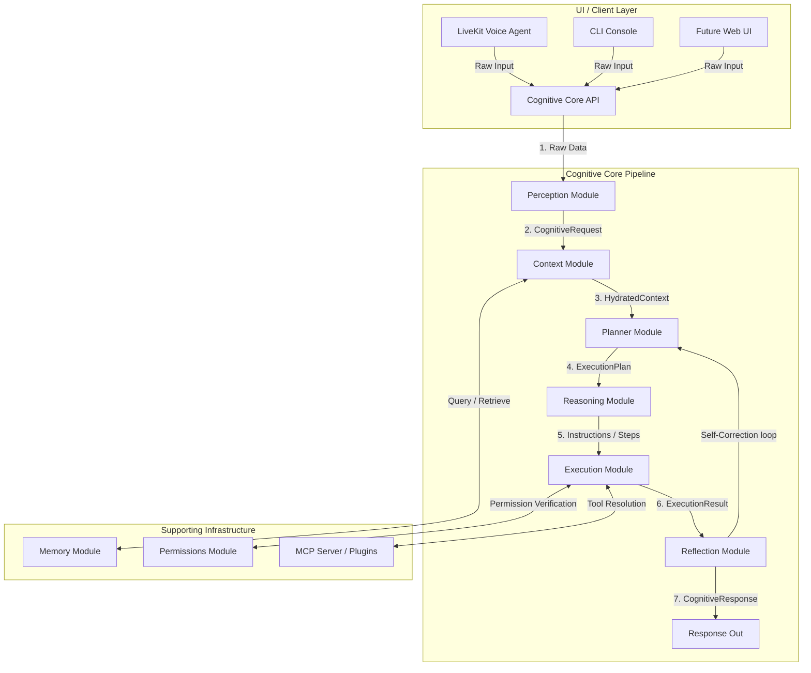

# ULTRON Cognitive Core Architecture

This document describes the design, data models, and interaction protocols of the **Cognitive Core**—the central reasoning pipeline of the ULTRON Cognitive Operating System.

---

## 1. Architectural Pipeline Overview

The Cognitive Core is a decoupled, UI-independent pipeline. It normalizes external requests (voice, text, or multi-modal packages), hydrates them with system context (memory, preferences, and projects), generates structured execution plans, executes those plans safely, and reflects on the output for self-correction.



---

## 2. Pipeline Data Flow

1.  **Perception**: Receives user inputs (voice streams, text blocks, or screenshots) and translates them into a standardized, UI-agnostic `CognitiveRequest` object.
2.  **Context**: Hydrates the `CognitiveRequest` with user settings, active project metadata, and relevant memory vectors to produce a `HydratedContext` object.
3.  **Planner**: Examines the hydrated context and constructs a sequence of dependent execution tasks wrapped in an `ExecutionPlan`.
4.  **Reasoning**: Decides how each step in the plan should be addressed (selecting target LLM models, custom prompts, or identifying tool invocation schemas).
5.  **Execution**: Runs tools, processes shell scripts, or scrapes urls. It acts as the execution agent and routes warning or critical commands through the Permissions Module first.
6.  **Reflection**: Audits execution results, evaluates if task metrics have been met, and decides whether to trigger a corrective replanning loop or formulate the final `CognitiveResponse`.

---

## 3. Standardized Interface Data Models

### `CognitiveRequest`
Encapsulates normalized input from any client interface.
```python
class Modality(Enum):
    TEXT = "text"
    VOICE = "voice"
    IMAGE = "image"
    DOCUMENT = "document"
    VIDEO = "video"
    SCREEN = "screen"

class CognitiveRequest:
    session_id: str
    modality: Modality
    payload: bytes          # Raw data (audio frames, text buffers, image bytes)
    metadata: Dict[str, Any] # Client metadata (timestamps, browser info, sample rate)
```

### `HydratedContext`
Combines the normalized request with contextual workspace, memory, and user profile attributes.
```python
class HydratedContext:
    request: CognitiveRequest
    user_name: str
    preferences: Dict[str, Any]
    project_metadata: Dict[str, Any]
    relevant_memories: List[Dict[str, Any]]
```

### `ExecutionPlan`
A collection of tasks that represent the steps required to fulfill the user's request.
```python
class Task:
    task_id: str
    description: str
    dependencies: List[str]
    status: str             # "pending" | "running" | "completed" | "failed"
    result: Optional[Any]

class ExecutionPlan:
    objective: str
    tasks: List[Task]
```

### `ExecutionResult`
Encapsulates the output of a single execution block or tool invocation.
```python
class ExecutionResult:
    task_id: str
    success: bool
    output: Any
    error_message: Optional[str]
```

### `CognitiveResponse`
The final normalized output produced by the Reflection module, routed back to the client interface.
```python
class CognitiveResponse:
    session_id: str
    text_content: str
    audio_content: Optional[bytes]
    metadata: Dict[str, Any]
```

---

## 4. Modalities Extension Strategy

Future input modalities (such as images, PDFs, video, or real-time screen captures) can be supported without modifying the Cognitive Core.
1.  **Add Modality Enum**: Declare the target modality type in the `Modality` enum.
2.  **Modality Converters**: Register specialized converter strategies in the `Perception` module to decode raw input frames or PDF buffers into internal schemas.
3.  **Context Hydration**: The `Context` module retrieves domain-specific documentation (e.g. matching image metadata or document scopes) and appends it to the `HydratedContext`.
4.  **Reasoning Dispatcher**: The `Reasoning` module selects appropriate multi-modal LLM models (e.g., vision-capable variants) when handling visual payloads.
