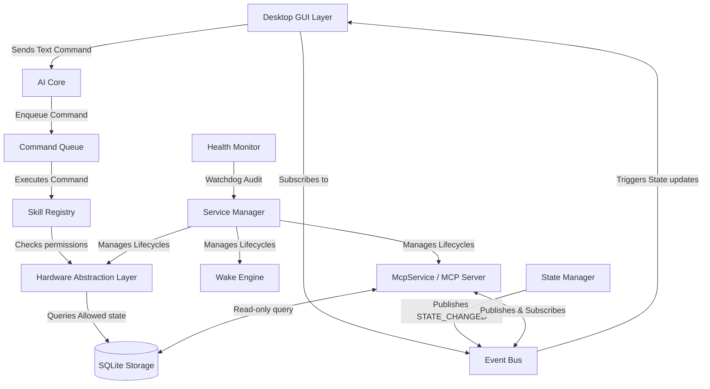

# ULTRON System Architecture

This document describes the design, responsibilities, and communications of the ULTRON Cognitive OS subsystems.

## 1. System Communication Topology

---

## 2. Subsystem Definitions

### Boot Manager
- **File**: `ultron/core/boot_manager.py`
- **Responsibility**: Coordinates Power-On Self-Test (POST) steps at system startup, sequentially validating all 12 core layers and reporting percent completion.
- **Connection**: Relies on `MemoryManager`, `SkillRegistry`, and config file system.

### MCP Service
- **File**: `mcp/service.py`
- **Responsibility**: First-class service hosting the modular Model Context Protocol (MCP) server asynchronously. Exposes tools for filesystem browsing, symbol parsing, git operations, documentation access, and UME memory CRUD.
- **Connection**: Managed by `ServiceManager`. Subscribes to system state transitions and publishes client directives on the `Event Bus`. Exposes SQLite tables and config logs as read-only resources.

### State Manager
- **File**: `ultron/core/state_manager.py`
- **Responsibility**: Singleton managing the central system state: `Sleeping`, `Listening`, `Thinking`, `Executing`, `Speaking`, `Error`, and `Shutdown`.
- **Connection**: Publishes `"STATE_CHANGED"` notifications to the Event Bus. Subscribes to SAPI5 audio start/stop states.

### AI Core
- **File**: `ultron/core/ai_core.py`
- **Responsibility**: Acts as the central pipeline coordinator. It normalizes inputs, triggers planners, maps skills, and returns feedback dialogue.
- **Connection**: Manages the `CommandQueue` and triggers TTS via the `SpeechService`.

### Wake Engine
- **File**: `ultron/core/wake_engine.py`
- **Responsibility**: Unifies text and voice wake phrase actions. Tracks inactivity timers, automatically returning the system to standby `Sleeping` state after 10 seconds.
- **Connection**: Subscribes to `"STATE_CHANGED"`. Connects to `Pyttsx3VoiceProvider` to speak greetings and deactivation notices.

### Event Bus
- **File**: `ultron/core/event_bus.py`
- **Responsibility**: High-performance, in-memory publisher-subscriber hub that allows complete decoupling of OS modules.
- **Connection**: Used by all managers, UI animations, diagnostics, and the MCP Service.

### Service Manager
- **File**: `ultron/core/service_manager.py`
- **Responsibility**: Governs the startup, shutdown, registry, and hot-reload of background loops.
- **Connection**: Manages `WakeService`, `SpeechService`, `VoiceRecognitionService`, and `McpService`.

### Health Monitor
- **File**: `ultron/core/health_monitor.py`
- **Responsibility**: Watchdog auditing background loops every 5 seconds. If a service becomes degraded, it attempts a restart (maximum 3 retries) and emits alerts.
- **Connection**: Tracks entries in `ServiceManager`.

### Configuration Manager
- **File**: `ultron/core/config_loader.py`
- **Responsibility**: Reads configuration JSON files, providing fail-safe values and supporting environment variable overrides (`ULTRON_{SECTION}_{KEY}`).
- **Connection**: Feeds default values to memory, skills, and TTS.

### Conversation Manager
- **File**: `ultron/core/conversation_manager.py`
- **Responsibility**: Formulates prompt context, loading user identity, and history constraints.
- **Connection**: Restores histories from conversation memory domains.

### Command Queue
- **File**: `ultron/core/command_queue.py`
- **Responsibility**: Sequential FIFO worker queue preventing concurrent task overlaps.
- **Connection**: Enqueues directives submitted from `AI Core`.

### Skill Registry
- **File**: `ultron/skills/registry.py`
- **Responsibility**: Resolves target commands (e.g. `Open Notepad`) to actual executing classes.
- **Connection**: Loaded with built-in skills (ProjectManager, FileSystem) and third-party plugins.

### Plugin Loader
- **File**: `ultron/core/plugin_loader.py`
- **Responsibility**: Dynamically parses plugin directories, imports modules, and registers skills during boot.
- **Connection**: Adds custom classes to `SkillRegistry`.

### Memory Domains
- **File**: `ultron/memory/domains.py` (and UME tables)
- **Responsibility**: Decouples local SQL databases into isolated domain schemas: Preferences, Permissions, Conversations, Projects, Knowledge, and SessionData.
- **Connection**: Integrated with UI dashboards.

### Vision Manager
- **File**: `ultron/core/vision_manager.py`
- **Responsibility**: Manages native camera checks and image capture frames.
- **Connection**: Connects with LLM context prompts.

### LLM Manager
- **File**: `ultron/core/llm_manager.py`
- **Responsibility**: Wraps offline/local LLM providers.
- **Connection**: Coordinates prompts for the planners.

### Task Manager
- **File**: `ultron/core/task_manager.py`
- **Responsibility**: Tracks tasks through start, completion, or failure lifecycle steps.
- **Connection**: Feeds active task counts to the UI developer console.

### Notification Center
- **File**: `ultron/core/notification_center.py`
- **Responsibility**: Dispatches desktop notifications and retains history of alerts.
- **Connection**: Publishes warnings to the Event Bus.

### Permission Manager (HAL)
- **File**: `ultron/hal/hal_manager.py`
- **Responsibility**: Checks microphone, speaker, and camera hardware.
- **Connection**: Controls service loading based on preferences.

### Developer Tools
- **File**: `ui/developer_console.py`
- **Responsibility**: Collapsible developer console overlay tracking real-time event logs, system logs, and task lists.
- **Connection**: Activated via `Ctrl+Shift+D`.
