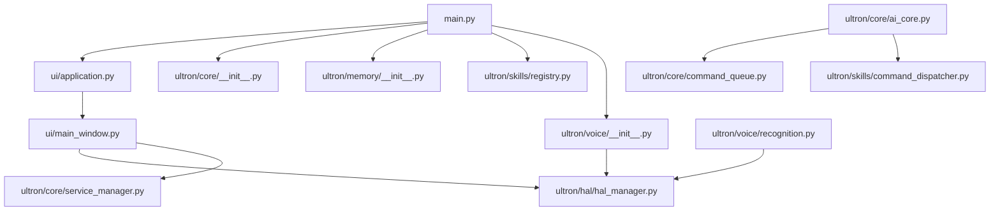

# ULTRON Dependency Map

This document lists the dependencies between ULTRON modules.

---

## 1. System Module Dependency Graph

---

## 2. Dependency Analysis

### Tight Coupling Identification
- **HAL Dependency**: Subsystems (Microphone, Speaker, Recognition, settings widgets) query hardware authorization status directly from the HAL manager.
- **Solution**: Decoupled using dynamic accessors (`get_hal_manager()`), preventing circular import errors at startup.

---

## 3. Future Improvements
- **IPC Event Routing**: For future multi-process scaling, replace in-memory Event Bus lists with local network sockets or named pipes.
- **Dynamic Skill Loading**: Decouple dispatcher checks from specific class imports, allowing the Skill Registry to resolve task execution dynamically using plugins.
